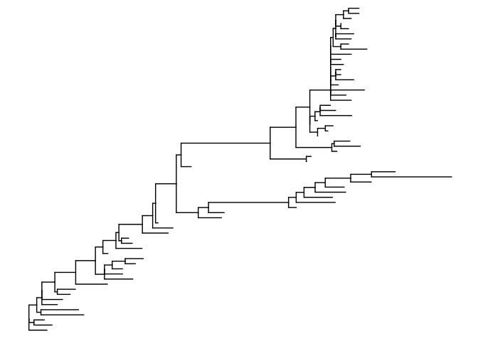
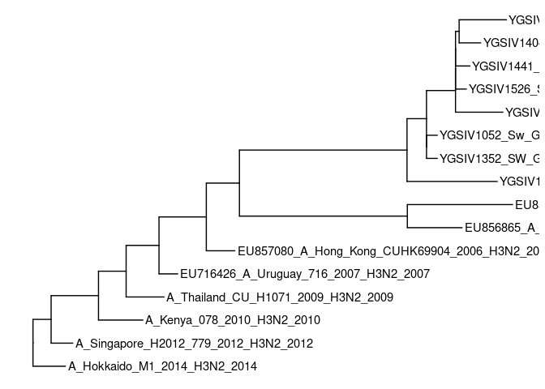

Setup
-----

We’ll be using the following packages:

    library(dplyr)

    ## 
    ## Attaching package: 'dplyr'

    ## The following objects are masked from 'package:stats':
    ## 
    ##     filter, lag

    ## The following objects are masked from 'package:base':
    ## 
    ##     intersect, setdiff, setequal, union

    library(tidyr)
    library(castor)

    ## Loading required package: Rcpp

    library(phangorn)

    ## Loading required package: ape

    library(phytools)

    ## Loading required package: maps

    library(ggtree)

    ## ggtree v3.2.1  For help: https://yulab-smu.top/treedata-book/
    ## 
    ## If you use ggtree in published research, please cite the most appropriate paper(s):
    ## 
    ## 1. Guangchuang Yu. Using ggtree to visualize data on tree-like structures. Current Protocols in Bioinformatics. 2020, 69:e96. doi:10.1002/cpbi.96
    ## 2. Guangchuang Yu, Tommy Tsan-Yuk Lam, Huachen Zhu, Yi Guan. Two methods for mapping and visualizing associated data on phylogeny using ggtree. Molecular Biology and Evolution. 2018, 35(12):3041-3043. doi:10.1093/molbev/msy194
    ## 3. Guangchuang Yu, David Smith, Huachen Zhu, Yi Guan, Tommy Tsan-Yuk Lam. ggtree: an R package for visualization and annotation of phylogenetic trees with their covariates and other associated data. Methods in Ecology and Evolution. 2017, 8(1):28-36. doi:10.1111/2041-210X.12628

    ## 
    ## Attaching package: 'ggtree'

    ## The following object is masked from 'package:ape':
    ## 
    ##     rotate

    ## The following object is masked from 'package:tidyr':
    ## 
    ##     expand

    library(treeio)

    ## treeio v1.18.1  For help: https://yulab-smu.top/treedata-book/
    ## 
    ## If you use treeio in published research, please cite:
    ## 
    ## LG Wang, TTY Lam, S Xu, Z Dai, L Zhou, T Feng, P Guo, CW Dunn, BR Jones, T Bradley, H Zhu, Y Guan, Y Jiang, G Yu. treeio: an R package for phylogenetic tree input and output with richly annotated and associated data. Molecular Biology and Evolution 2020, 37(2):599-603. doi: 10.1093/molbev/msz240

    ## 
    ## Attaching package: 'treeio'

    ## The following object is masked from 'package:phytools':
    ## 
    ##     read.newick

    ## The following object is masked from 'package:ape':
    ## 
    ##     drop.tip

All are available from conda as well, so smth like the following
environment `.yaml` file would work:

    channels:
     - conda-forge
     - bioconda
    dependencies:
     - r=4.1
     - r-dplyr
     - r-tidyr
     - r-svglite
     - r-ape=5.5
     - r-phangorn=2.8.0
     - r-phytools=0.7_90
     - r-castor=1.7.2
     - bioconductor-biostrings=2.62.0
     - bioconductor-ggtree=3.2.0
     - bioconductor-treeio=1.18.0

Reading trees
=============

Different software generates trees in different text formats. For most
of them there are `read.*` import functions. The most popular formats
are as follows:

<table>
<colgroup>
<col style="width: 25%" />
<col style="width: 34%" />
<col style="width: 39%" />
</colgroup>
<thead>
<tr class="header">
<th style="text-align: left;">Format</th>
<th style="text-align: left;">Example R functions</th>
<th style="text-align: left;">Example software</th>
</tr>
</thead>
<tbody>
<tr class="odd">
<td style="text-align: left;"><a href="https://evolution.genetics.washington.edu/phylip/newicktree.html">newick</a></td>
<td style="text-align: left;"><code>ape::read.tree</code> (<code>phylo</code>), <code>treeio::read.astral</code> (<code>treedata</code>), <code>treeio::read.iqtree</code> (<code>treedata</code>)</td>
<td style="text-align: left;">very widespread, e.g. <a href="http://www.iqtree.org/">iqtree</a> (<code>.treefile</code>), <a href="https://github.com/smirarab/ASTRAL">astral</a></td>
</tr>
<tr class="even">
<td style="text-align: left;"><a href="http://wiki.christophchamp.com/index.php?title=NEXUS_file_format">nexus</a></td>
<td style="text-align: left;"><code>ape::read.nexus</code> (<code>phylo</code>), <code>treeio::read.beast</code> (<code>treedata</code>)</td>
<td style="text-align: left;"><a href="https://paup.phylosolutions.com/">PAUP</a>, <a href="https://beast.community/">BEAST</a></td>
</tr>
<tr class="odd">
<td style="text-align: left;"><a href="https://www.cs.cmu.edu/~aiton/split/Manual-2.6.master014.html">nhx</a></td>
<td style="text-align: left;"><code>treeio::read.nhx</code> (<code>treedata</code>)</td>
<td style="text-align: left;"><a href="http://www.cs.cmu.edu/~durand/Notung/">Notung</a> and other reconciliation software</td>
</tr>
</tbody>
</table>

The tree data are represented in R in the objects of three main R
classes:

-   `phylo` which is a basic format and a common denominator across
    multiple packages;
-   `treedata` that is very useful when it comes to storing annotations
    (it includes a slot `@phylo` that stores the topology) and
-   `tbl_tree` which is essentially a `tibble` containing node data in
    tabular format.

`phylo` and `treedata` objects are what the read functions produce (as
indicated). `treedata` is supported by `ape` and `ggtree` and is useful
for plotting trees with annotations, `tbl_tree` is not a strict tree
format and can be modified as any other tibble as long as no rows are
added or removed. Inter-conversion is mostly straightforward: there are
functions `as.phylo`, `as.treedata`, `as_tibble`, but notice that
conversion to `phylo` is not lossless as it preserves only topology,
branch lengths and node labels. Also, table operations on `tbl_tree`
often lead to losing the correct class and obscure errors with
`as.treedata`, so in case this happens enforce classes with
`class(c("tbl_tree", "tbl_df", "tbl", "data.frame"))` (see below).

As an example, we’ll take an example RAxML tree of XXXXXXX:

    tree_file <- system.file("extdata/RAxML", "RAxML_bipartitions.H3", package = "treeio")
    big_tree <- read.tree(tree_file)

To make a cursory look at the tree will use the `ggtree` function:

    ggtree(big_tree)

The tree is quite big, so let’s pick every 4th tip using
`ape::keep.tip`:

    tips_to_keep <- with(big_tree, tip.label[seq(to = length(tip.label), by = 4)])
    tree <- keep.tip(big_tree, tips_to_keep)
    ggtree(tree) + geom_tiplab()

This looks more manageable for us (of course in real life you remove
tips only if you have good reasons).

Now let’s add some metadata to the tree using its tabular
representation. Now, in most of the cases these annotations would
probably come from a separate annotation file, but in this case the tip
label are quite verbose, so we can them for our toy example – we’ll
extract the year and the “type” (it’s a mock – just the first letter of
the label):

    tree_data <- as_tibble(tree) %>%
        extract(label, into = c("type", "year"), regex = "(.).+_([0-9]+)", remove = F, convert = T) %>%
        mutate(isInner = node %in% parent, isRoot = node == parent) %>%
        mutate(support = ifelse(isInner | isRoot, label, NA), support = as.numeric(support)) %>%
        `class<-`(c("tbl_tree", "tbl_df", "tbl", "data.frame")) %>%
        as.treedata
    ggtree(tree_data) + geom_tiplab()

Tree rooting
============

To display trees in rooted layouts and for analyses that rely on rooted
trees, trees must be rooted. In some cases, the trees are already rooted
to begin with (e.g. obtained by phylogenetic placement with an already
rooted reference tree). In general case though, common phylogenetic
programs produce either explicitly unrooted trees or trees that should
be treated as unrooted. In such cases, the trees should be (re-)rooted
using one of the following strategies:

-   outgroup rooting – OTUs a priori known not to belong to the group of
    interest, i.e. the ingroup, the recommended strategy
-   midpoint rooting – this procedure places the root in the geometric
    middle of the tree, should be used with caution and mostly only for
    visualization
-   minimal ancestor deviation and minimum variance rooting
-   nonreversible models (see
    [root\_digger](https://github.com/computations/root_digger) and
    [rootstrap](http://www.iqtree.org/doc/Rootstrap))
-   molecular clock (e.g. UPGMA in the extreme unrealistic case)

One important point about tree rooting concerns inner node and edge
labels. Most of the formats and classes for storing phylogenetic trees
code both, iternal node and edge attributes as inner nodes labels. This
becomes relevant when an edge reverses its orientation due to
(re-)rooting and is particularly important for support values that are
edge attributes. It should be kept in mind that different rooting
programs and functions eiter simply treat all inner node labels as node
attributes and thus produce incorrect output most of the time or have
parameters/arguments that them to treat the labels as either node or
edge attributes.

Depending on the circumstances, it is sometimes desirable to root the
trees before importing them in R, e.g. with nw\_reroot from [newick
utilities](https://github.com/tjunier/newick_utils) – it has a switch
for treating inner node as edge attributes). For MAD rooting there are
[mad](https://www.mikrobio.uni-kiel.de/de/ag-dagan/ressourcen) and
[madRoot](https://github.com/davidjamesbryant/MADroot), although both
have issues with edge labels. For nonreversible models there are
[root\_digger](https://github.com/computations/root_digger) and iqtree’s
implementation of [rootstrap](http://www.iqtree.org/doc/Rootstrap),
although note that iqtree will only assign rootstrap support values and
not actually re-root the input tree.

Among R packages, the following functions can correctly treat edge
labels:

-   `ape::root(edgelabel = T)`
-   `phangorn::midpoint(node.labels = "support")`

Some code for future:

    scaleClades <- function(p, df) {
        with(df, Reduce(function(.p, .node) {
            offs <- offspring(.p$data, .node)
            scale <- 0.5 / (nrow(offs) - 1)
            scaleClade(.p, .node, scale)
        }, node, p))
    }
    collapseClades <- function(p, df) {
        with(df, Reduce(function(.p, .node) {
            fill <- unlist(colors[Host[node == .node]])
            .p$data[.p$data$node == .node, "label.show"] <- label.show[node == .node]
            collapse(.p, .node, "mixed", fill = fill)
        }, node, p))
    }

    multi_species <- allDescendants(tree_data@phylo) %>%
        lapply(function(x) filter(tree, node %in% x)) %>%
        bind_rows(.id = "ancestor") %>%
        group_by(ancestor) %>%
        filter(n_distinct(Collapse, na.rm = T) == 1, sum(!isInternal) > 1) %>%
        ungroup %>%
        mutate(ancestor = as.numeric(ancestor)) %>%
        filter(! ancestor %in% node) %>%
        filter(!is.na(Collapse)) %>%
        group_by(ancestor, Collapse) %>%
        summarize(num_tips = sum(!isInternal), Host = first(na.omit(Host))) %>%
        mutate(label.show = sprintf("%s (%d)", Collapse, num_tips)) %>%
        rename(node = ancestor)
    p <- ggtree(tree_data) +
        geom_nodepoint(aes(x = branch, subset = !is.na(UFboot) & UFboot >= 90, size = UFboot)) +
        geom_tiplab(aes(label = label.show), size = 4, align = T, linesize = 0) +
        geom_text2(aes(subset = node %in% multi_species$node, x = max(x, na.rm = T), label = label.show), nudge_x = 0.01, size = 4, hjust = 0) +
        geom_tippoint(aes(color = Host), size = 3) +
        geom_treescale(width = 0.5) +
        scale_size_continuous(limits = c(90, 100), range = c(1, 3)) +
        scale_shape_manual(values = seq(0,15)) +
        scale_color_manual(values = colors)

    p <- scaleClades(p, multi_species)
    p <- collapseClades(p, multi_species)
